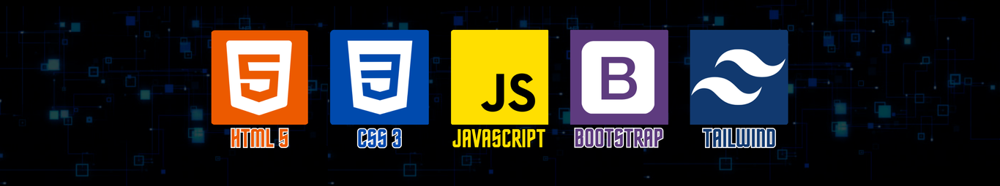

<!-- Seção com fundo preto e centralização -->

  

# ✨✨ RESUMO✨✨
✨Transformando ideias em código!✨ 
👩🏻‍💻| Desenvolvedora Full Stack em formação  
💡 | Apaixonada por criar soluções inovadoras  
🖥️| Habilidades em HTML5, CSS e Bootstrap  
📚 | Estudando atualmente Javascript, PHP , SQL e Python  
👩🏻‍🎓 | Cursando Ciências da Computação e Banco de Dados  
Sinta-se à vontade para explorar meus projetos e  
contribuir com ideias ou melhorias!   

# ✨✨ SOBRE MIM✨✨
Sou uma **desenvolvedora full stack em formação**, movida pela paixão em transformar  
ideias em **soluções digitais eficientes, intuitivas e centradas na experiência do usuário**.  
Busco constantemente evoluir tecnicamente, unindo criatividade, lógica e boas práticas  
para desenvolver aplicações que gerem valor real.
  

🎓 Atualmente, estou cursando: 
 **Ciências da Computação** (4º semestre) 
 **Tecnólogo em Banco De Dados** (2º semestre)  

🧩 <strong>Apaixonada por desafios</strong>: Sempre pronta para aprender e explorar novas tecnologias.  
📚 <strong>Curiosa e dedicada</strong>: Estou constantemente aprimorando minhas habilidades e buscando conhecimento.  
🎮 <strong>Jogadora criativa</strong>: Além de programar, adoro explorar o mundo dos jogos digitais e suas possibilidades.  
💡 <strong>Pensamento analítico</strong>: Gosto de resolver problemas de forma lógica, buscando soluções eficientes e bem estruturadas.  
🚀 <strong>Foco em evolução contínua</strong>: Encaro cada projeto como uma oportunidade de aprendizado e melhoria.  
🤝 <strong>Boa comunicação</strong>: Valorizo o trabalho em equipe, a troca de ideias e o crescimento coletivo.  
🛠️ <strong>Orientada a soluções</strong>: Transformo ideias em funcionalidades práticas e aplicáveis.  
📈 <strong>Comprometida com resultados</strong>: Busco qualidade, organização e clareza em tudo o que desenvolvo.  
🎨 <strong>Olhar criativo para interfaces</strong>: Prezo por experiências visuais limpas, intuitivas e funcionais.  
⏱️ <strong>Organizada e responsável</strong>: Cumpro prazos e mantenho disciplina nos processos de desenvolvimento.    

# 🚀🚀 TECNOLÓGIAS E FERRAMENTAS🚀🚀

Aqui estão algumas das ferramentas que adoro usar no meu dia a dia:

   

# 📊📊 GITHUB STATS📊📊

     
     
    

   

  
  

# ✍️✍️ CITAÇÕES DE DESENVOLVEDORES✍️✍️ 

