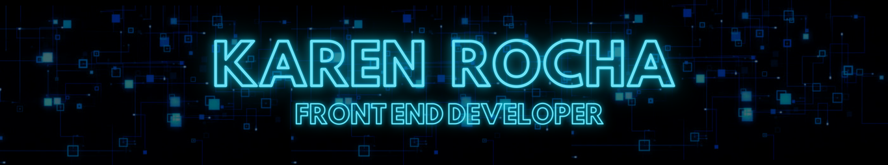

---

<h2 align="center">✨ RESUMO ✨</h2>

✨ Transformando ideias em código ✨  
👩🏻‍💻 Desenvolvedora Full Stack em formação 
💡 Apaixonada por criar soluções inovadoras 
🖥️ Experiência com HTML5, CSS e Bootstrap 
📚 Estudando JavaScript, PHP, SQL e Python 
👩🏻‍🎓 Ciências da Computação & Banco de Dados  
Sinta-se à vontade para explorar meus projetos 
e contribuir com ideias ou melhorias 🚀

---

<h2>✨ SOBRE MIM ✨</h2>

Sou uma **desenvolvedora full stack em formação**, movida pela paixão em transformar  
ideias em **soluções digitais eficientes, intuitivas e centradas na experiência do usuário**.  
Busco constante evolução técnica, unindo criatividade, lógica e boas práticas  
para desenvolver aplicações que gerem valor real.

 

🎓 **Formação atual**  
- Ciências da Computação — 4º semestre  
- Tecnólogo em Banco de Dados — 2º semestre  

 

🧩 **Apaixonada por desafios** — sempre pronta para aprender  
📚 **Curiosa e dedicada** — aprimoramento contínuo  
🎮 **Criativa** — interesse por jogos e interfaces  
💡 **Pensamento analítico** — foco em soluções eficientes  
🚀 **Evolução constante** — cada projeto é aprendizado  
🤝 **Boa comunicação** — valorizo trabalho em equipe  
🛠️ **Orientada a soluções** — ideias viram funcionalidades  
📈 **Comprometida com resultados** — qualidade e organização  
🎨 **Olhar para UI/UX** — interfaces limpas e funcionais  
⏱️ **Organizada e responsável** — disciplina e prazos  

---

<h2 align="center">🚀 TECNOLOGIAS E FERRAMENTAS 🚀</h2>

---

<h2 align="center">📊 ESTATÍSTICAS DO GITHUB 📊</h2>

  
  

 

  

---

<h2 align="center">🐍 MINHAS CONTRIBUIÇÕES 🐍</h2>

---

<h2 align="center">✍️ CITAÇÕES DE DESENVOLVEDORES ✍️</h2>

